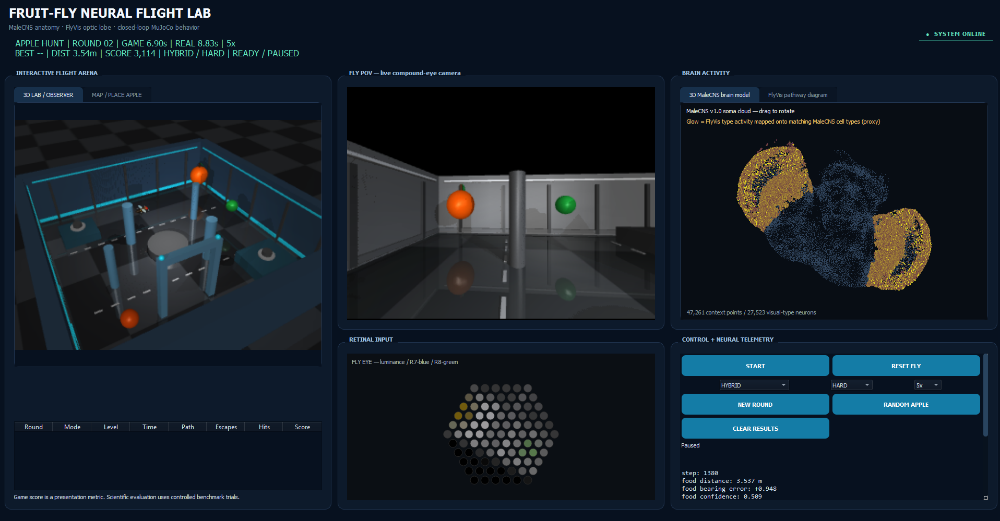

<div align="center">

# 🧠🪰 Fly Brain Drone

### We connected a real fruit-fly brain map to a virtual drone and asked it to find an apple.

**166,700 real neurons. 125 million real synapses. One (very) hungry drone.**

[](#status--this-is-not-finished)
[](LICENSE)
[](docs/dataset.md)
[](requirements.txt)

*A real neuroscience dataset. A real physics engine. A real, honestly-reported
mess of a research project — in public, as it happens.*



*An actual screenshot of the live dashboard — not a mockup. Left: the arena
from outside. Center: what the drone itself sees. Top right: 47,261 real
MaleCNS neuron positions with 27,523 visual-type neurons glowing by live
activity. Bottom right: the hexagonal compound-eye input and motor/telemetry
readout.*

</div>

---

## What is this?

In 2026, HHMI Janelia, Cambridge, and Google Research published the first
complete connectome of an adult fly's central nervous system — every one of
**166,700 neurons** and **~125,000,000 synapses** in a male *Drosophila*
brain and nerve cord, mapped from real electron-microscope images.

We asked a simple question: **can that wiring diagram actually pilot
something?**

So we built a closed loop:

```
 🍎 apple in a 3D room
      │  (rendered camera image only — no coordinates given to the brain)
      ▼
 MuJoCo drone's own eye
      │
      ▼
 connectome-derived visual processing  (real MaleCNS pathways + a pretrained
      │                                 connectome-constrained optic-lobe
      │                                 model, FlyVis)
      ▼
 motor decision  →  drone rotors  →  new camera frame  →  (loop)
```

The drone never receives the apple's coordinates. It only gets what its own
simulated eye sees. Whatever steering happens has to come out of the neural
pipeline.

## Status: this is **not finished**

We are building this in the open, incrementally, and we are not going to
pretend it's more finished than it is. Read this before you read anything
else in the repo.

**What currently works, reproducibly:**
- The full data pipeline: real MaleCNS v1.0 neuron/synapse data pulled live
  from [neuPrint](https://neuprint.janelia.org), cached locally, turned into
  a GPU spiking-neuron simulation.
- A physically simulated drone (MuJoCo) with a real rendered camera, real
  collision physics, and a real, verified 3-neuron circuit for steering and
  collision avoidance (see [`docs/scientific_assumptions.md`](docs/scientific_assumptions.md)
  for exactly which neurons and which papers).
- A **rendered-camera, closed-loop food search that actually works**: a
  pretrained, connectome-constrained visual-motion model
  ([FlyVis](https://github.com/TuragaLab/flyvis)) plus an engineered
  color-opponent readout finds an apple from a standing start, repeatably,
  across multiple positions, lighting levels, and food colors.
- A from-scratch GPU leaky-integrate-and-fire simulator, a lesion/ablation
  framework, and a baseline-controller benchmark suite (random / rule-based /
  connectome) — see [`experiments/results/`](experiments/results/).
- An interactive dashboard with a live 3D view of 141,781 real neuron
  positions, real-time activity, and a small "Apple Hunt" game mode built on
  top of the same controller.

**What does NOT work yet, said plainly:**
- Our own hand-built spiking simulation of the *raw* MaleCNS motion-detection
  circuit (photoreceptors → lamina → medulla → T4/T5) **does not reliably
  reproduce direction selectivity** — a real, deep finding, not a bug we
  papered over. We tried expanding the readout population three different
  ways and tried genuine moving-bar stimuli with real retinotopic positions;
  all failed the same diagnostic. Full story:
  [`docs/scientific_assumptions.md`](docs/scientific_assumptions.md).
- The part that *does* find food uses a **pretrained** connectome-constrained
  model (FlyVis) for motion, plus an **engineered** color-opponent circuit
  for "what is food" — not a literal simulation of MaleCNS end to end. We say
  exactly where the line is, everywhere in this repo.
- Color-based food detection currently recognizes "a warm-colored blob," not
  "an apple." Same-colored distractor spheres can fool it.
- Setup is real but not yet one-command-easy on every machine (Windows
  page-file/virtual-memory pressure has bitten us more than once — see
  [`PROJECT_STATUS.md`](PROJECT_STATUS.md)).

If you were hoping for a slick "it just works" demo video: not yet. If you're
interested in a transparent log of what happens when you actually try to wire
a real connectome into a real control loop — including the parts that broke,
why they broke, and what we learned from that — that's exactly what this repo
is.

## Why bother — isn't this already done?

Sort of. The moment MaleCNS v1.0 shipped, several people wired the connectome
into drones, games, and robots (see
[`research/existing_projects.md`](research/existing_projects.md) for the
honest survey — garyb9/fly-drone and skulitom/haltere in particular are very
close to parts of this project, and we say so). We're not claiming to have
invented "connectome drives a drone."

What we think is still open, and what this project is actually chasing:

1. **Not just "does it find food" — does it search the way a real fly
   does?** Real flies perform a specific, measurable behavior when they lose
   a food cue: a tight looping search that widens over time ("idiothetic
   local search"). Nobody we found compares a connectome-driven controller's
   *search statistics* against that published behavior. We built the
   mechanic for this (an occludable target, distance/bearing/search-time
   logging) — see [`docs/experiments.md`](docs/experiments.md).
2. **A rigorous, negative-results-included account of what a raw connectome
   simulation can and can't do**, with lesion studies and baseline
   comparisons, not just a highlight reel.

## The honesty rule this project runs on

Every claim in this repo is traceable to one of three buckets, documented in
[`docs/scientific_assumptions.md`](docs/scientific_assumptions.md):
**measured** (comes directly from the connectome data), **modeled**
(a standard, citable neuroscience approximation), or **engineering
abstraction** (our own design choice, labeled as such). We do not say "this
is the fly's brain," "the drone is thinking," or "we reproduced fly
intelligence" — anywhere. A connectome is a wiring diagram; we're testing
what that structure can and can't do as a controller.

## Quick start

```powershell
py -3.11 -m venv .venv
.venv\Scripts\pip install -r requirements.txt

# Set your own neuPrint token (free account at https://neuprint.janelia.org)
# Get it from the Account menu, then put it in a local .env (gitignored):
#   NEUPRINT_APPLICATION_CREDENTIALS=your_token_here

# Compile + run the core regression tests (no FlyVis needed)
.venv\Scripts\python.exe -m src.cli verify
```

The full FlyVis-powered food-search demo needs a second, separate
environment (FlyVis pins specific package versions) — full setup, including
a from-scratch clean-machine validation script, is in the
[Setup section below](#full-setup-flyvis-powered-demo) and
[`PROJECT_STATUS.md`](PROJECT_STATUS.md).

```powershell
# One closed-loop food-search trial
.\.flyvis-venv\Scripts\python.exe -m src.cli search

# Watch it live in a MuJoCo window
.\.flyvis-venv\Scripts\python.exe -m src.cli demo

# Interactive dashboard: click the arena to move the apple
.\.flyvis-venv\Scripts\python.exe -m src.cli dashboard
```

## Full setup (FlyVis-powered demo)

```powershell
py -3.11 -m venv .flyvis-venv
.\.flyvis-venv\Scripts\python.exe -m pip install -r requirements-flyvis.txt
.\.flyvis-venv\Scripts\python.exe scripts\patch_flyvis_windows.py
.\.flyvis-venv\Scripts\python.exe scripts\setup_flyvis_data.py --ensure
```

Or reproduce the entire install-and-validate path from a throwaway
environment in one command (also runs as CI on `windows-latest`, see
[`.github/workflows/windows-smoke.yml`](.github/workflows/windows-smoke.yml)):

```powershell
.\scripts\clean_setup_smoke.ps1
```

Full command reference, current benchmark numbers, and the complete phase-by-
phase experiment log: [`PROJECT_STATUS.md`](PROJECT_STATUS.md).

## Project structure

```
fly-brain-drone/
├── docs/                  architecture, dataset, scientific assumptions, experiments
├── research/              survey of prior art — what already exists, what's new here
├── src/
│   ├── brain/             connectome loading (live neuPrint), GPU LIF simulator, verified pathways
│   ├── vision/            camera → visual-neuron encoding, FlyVis backend
│   ├── control/           neural activity → drone commands, Apple Hunt game logic
│   ├── drone/             MuJoCo drone physics, camera, dynamics
│   ├── environment/       arena, obstacles, food target
│   ├── visualization/     brain view, drone view, dashboard
│   └── experiments/       30 phases of experiments, each one runnable
├── experiments/results/   CSVs and plots from every benchmark run
├── scripts/               Windows setup/patch/smoke-test automation
├── tests/                 regression suite
└── PROJECT_STATUS.md      the detailed, continuously-updated lab notebook
```

## Who this is for

Neuroscience people who want to see what a real connectome does (and
doesn't) do when you actually try to run it. Robotics/simulation people
curious about connectome-constrained control. Anyone who'd rather read a
project's real failure modes than its highlight reel. If that's you, a ⭐ or
an issue with what you'd try next is genuinely useful — this is very much
still being built.

## License

Code: MIT (see [`LICENSE`](LICENSE)). The MaleCNS v1.0 connectome data is
separately licensed CC-BY 4.0 by HHMI Janelia / Cambridge Connectomics /
Google Research; the FlyVis pretrained model has its own upstream license —
see [`docs/dataset.md`](docs/dataset.md) for attribution. Neither dataset is
redistributed in this repository.
