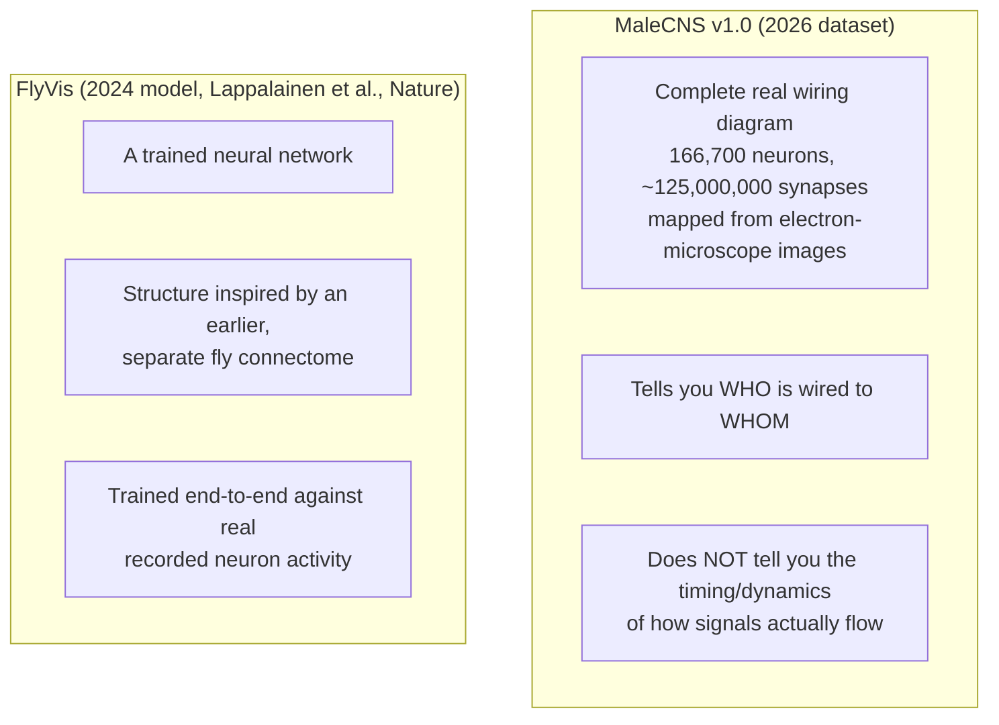
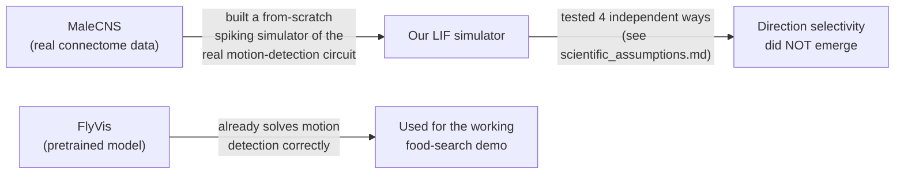

# FAQ — what is actually going on here?

Written for anyone opening this repo cold and asking "wait, what is this
actually doing?" If you want the full technical detail behind any answer
below, follow the link — this page is deliberately the short version.

## 1. The pipeline, in one picture

The drone is never given the apple's coordinates. Everything it does has to
come out of this loop, starting from a rendered camera image.

## 2. MaleCNS vs. FlyVis — two different things, easy to mix up

These are **not the same thing**, and the project uses both for different
reasons.

**Analogy:** MaleCNS is a complete electrical wiring diagram of a house —
every wire, every junction, precisely mapped. But a wiring diagram alone
doesn't tell you how current actually flows through the house moment to
moment. FlyVis is like an engineer who took a similar (not identical)
wiring diagram and tuned a working model against a real electricity meter,
so it correctly predicts real current flow.

### What we actually did with each one

We did not give up on MaleCNS and quietly swap it out — we tried, in
public, for real, and documented exactly why the raw connectome circuit
didn't work in our hands. Full diagnostic story:
[`scientific_assumptions.md`](scientific_assumptions.md).

## 3. Why does the drone find "food" by color instead of recognizing an apple?

Two real reasons, not just a shortcut:

1. **Real biological basis.** Real *Drosophila* photoreceptors include R7
   (UV/blue-sensitive) and R8 (green-sensitive) subtypes, alongside R1-R6
   (broadband brightness-only) — all confirmed present as annotated neuron
   types in MaleCNS. We use the simulated camera's blue and green channels
   as stand-ins for R7/R8 (the virtual camera has no true UV channel) and
   compute a red-vs-green "opponent" signal — directly inspired by this
   real channel structure, not invented from nothing.
2. **A trained detector was tried first, and it failed honestly.** An
   earlier attempt trained a linear food-readout on camera data — it hit
   94% accuracy in one room, then collapsed to 27% in a new room. It had
   memorized the room's background, not learned "food." The simpler,
   interpretable color-opponent circuit generalized correctly instead.
   Full numbers: [`scientific_assumptions.md`](scientific_assumptions.md).

**What this means honestly:** the drone currently recognizes "a
warm-colored blob," not "an apple" specifically. A same-colored distractor
sphere can fool it. This is stated plainly, not hidden.

## 4. Could raw MaleCNS ever produce direction selectivity, without FlyVis?

Our honest, split answer:

- **Does the anatomical wiring itself contain enough structure?** Very
  likely yes — the specific cell types and connections known from real fly
  literature to cause direction selectivity (fast Mi1/Tm3 pathway, slow
  Mi9/Mi4 pathway, both feeding T4/T5) are measured and present in MaleCNS,
  not assumed.
- **Does our own additive-only spiking (LIF) simulator reproduce it?** No —
  four independent attempts failed the same diagnostic (expanded readout
  populations, a genuine retinotopic moving-bar stimulus, differential
  membrane time constants, central-complex connectivity). The most likely
  cause: real direction selectivity needs a multiplicative/shunting-
  inhibition computation, which a purely additive model can't represent,
  regardless of which neurons are read out.

This is exactly the gap FlyVis fills — it reproduces this correctly by
being trained end-to-end against real recordings.

## 5. What did other, similar projects do?

Full survey: [`research/existing_projects.md`](../research/existing_projects.md).
Short version: none of the projects we found used FlyVis or any comparable
pretrained connectome-constrained model. Most used a standard CNN or simple
hand-engineered image statistics for vision, and none did color-based food
detection specifically — their tasks were racing, stability control, or
games, not foraging.

## 6. Is this project "done"?

No. See the README's
["Status: this is not finished"](../README.md#status-this-is-not-finished)
section, and read [`scientific_assumptions.md`](scientific_assumptions.md)
for the continuously updated, complete list of what's measured, what's a
standard modeled approximation, and what's an explicit engineering
shortcut.
